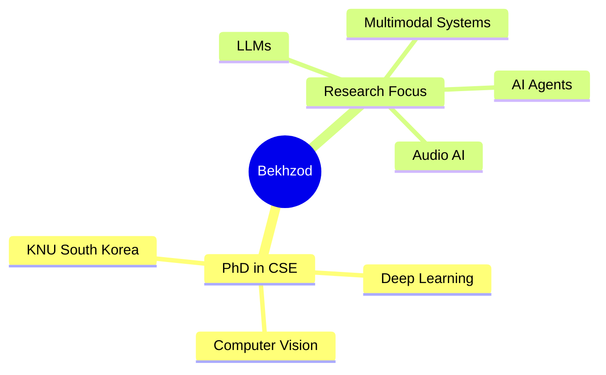

<!-- Animated Header with Wave -->
<div align="center">
  
# 🌟 Welcome to Bekhzod's AI Universe 🌟


<!-- Typing Animation -->
<a href="https://git.io/typing-svg"></a>

<!-- Profile Views Counter -->


<!-- Social Media Badges -->
<p align="center">
  <a href="https://www.linkedin.com/in/bekhzod-olimov-phd-33059bb1/"></a>
  <a href="https://scholar.google.com/citations?user=3QhMoi0AAAAJ&hl=en"></a>
  <a href="https://github.com/bekhzod-olimov"></a>
  <a href="https://github.com/TeachAI-UZ"></a>
</p>

</div>

---

<!-- Animated Gradient Divider -->


<!-- About Me Section with Stunning Design -->
<div align="center">

## 🎯 About Me


</div>

<table align="center">
<tr>
<td width="50%" valign="top">

### 👨‍🎓 Academic Excellence



</td>
<td width="50%" valign="top">

### 💼 Professional Journey

```diff
@@  Current Roles  @@
+ AI Team Lead (Director) @ ChiwoocheonSoft
+ Principal AI Engineer & Researcher
+ Founder of TeachAI-UZ

@@  Impact  @@
+ 12 Production AI Systems Deployed
+ 7+ Years in AI/ML (Healthcare, Manufacturing, Gov)
+ 470+ Citations | h-index: 11
+ 2-3× GPU Inference Speedups

! Transforming Ideas into Intelligent Solutions
# Open to Collaboration 🤝
```

</td>
</tr>
<tr>
<td colspan="2">

<div align="center">

### 🔬 Research Interests

<table>
  <tr>
    <td align="center" width="25%">
      <br>
      <b>Computer Vision</b><br>
      <sub>Image Processing & Analysis</sub>
    </td>
    <td align="center" width="25%">
      <br>
      <b>Large Language Models</b><br>
      <sub>NLP & Text Generation</sub>
    </td>
    <td align="center" width="25%">
      <br>
      <b>Audio Processing</b><br>
      <sub>Speech & Sound AI</sub>
    </td>
    <td align="center" width="25%">
      <br>
      <b>AI Agents</b><br>
      <sub>Autonomous Systems</sub>
    </td>
  </tr>
</table>

<br>

**🎓 PhD from [Kyungpook National University](https://en.knu.ac.kr/main/main.htm)** | **📍 Based in South Korea** | **🚀 Founder of [TeachAI-UZ](https://github.com/TeachAI-UZ)**

</div>

</td>
</tr>
</table>

<!-- Animated Gradient Divider -->


---

<!-- Tech Arsenal Section -->
<div align="center">

## 🛠️ Technical Arsenal

### 💻 Core Languages


### 🤖 Generative AI & LLMs


### ⚡ GPU Optimization


### 📚 NLP & Document AI


### 👁️ Computer Vision


### 🎙️ Speech AI


### 🏗️ ML Frameworks & Tools


### 🚀 MLOps & Deployment


### 🔧 DevOps & Infrastructure


### 🔬 Research & AI Safety


</div>

---

<!-- Animated Gradient Divider -->


<!-- GitHub Stats Section -->
<div align="center">

## 📊 GitHub Analytics

<p align="center">
  
  
</p>

<p align="center">
  
</p>

<!-- GitHub Trophies -->
<p align="center">
  
</p>

<!-- Contribution Graph - Full History -->


<!-- Snake Animation -->
<picture>
  <source media="(prefers-color-scheme: dark)" srcset="https://raw.githubusercontent.com/bekhzod-olimov/bekhzod-olimov/main/output/github-contribution-grid-snake-dark.svg">
  <source media="(prefers-color-scheme: light)" srcset="https://raw.githubusercontent.com/bekhzod-olimov/bekhzod-olimov/main/output/github-contribution-grid-snake.svg">
  
</picture>

</div>

---

<!-- Animated Gradient Divider -->


<!-- Featured Projects & Work -->
<div align="center">

## 🚀 Featured Projects & Systems

<table>
  <tr>
    <td align="center" width="25%">
      
      <h3>🤖 LexiAI-UZ</h3>
      <p><b>Legal Document AI</b></p>
      <sub>RAG system • 91% QA accuracy<br>25K+ documents • 10K+ queries/month<br>2.9× inference speedup</sub>
      <br><br>
      <a href="https://www.linkedin.com/posts/bekhzod-olimov-phd-33059bb1_lexiai-suniyintellekt-huquqiytexnologiyalar-activity-7370718096673878016-vjhR">
        
      </a>
    </td>
    <td align="center" width="25%">
      
      <h3>🎙️ UzbekVoiceAgent</h3>
      <p><b>Multilingual Voice AI</b></p>
      <sub>STT + TTS + LLM pipeline<br>500+ daily users • 95% accuracy<br>3-stage RAG architecture</sub>
      <br><br>
      <a href="https://www.linkedin.com/posts/bekhzod-olimov-phd-33059bb1_ai-speechrecognition-naturallanguageprocessing-activity-7359483392368807936-mkeS">
        
      </a>
    </td>
    <td align="center" width="25%">
      
      <h3>💪 AI Health Trainer</h3>
      <p><b>Real-time Pose Estimation</b></p>
      <sub>MediaPipe + OpenCV<br>95%+ accuracy • 300+ users/month<br>Privacy-preserving AI</sub>
      <br><br>
      <a href="https://huggingface.co/spaces/bekhzod-olimov/AIHealthTrainer">
        
      </a>
    </td>
    <td align="center" width="25%">
      
      <h3>🗣️ Sehro TTS</h3>
      <p><b>Uzbek Text-to-Speech</b></p>
      <sub>VITS fine-tuning • 81% quality<br>100+ daily users • <3s latency<br>Production deployment</sub>
      <br><br>
      <a href="https://sehrotts.duckdns.org/">
        
      </a>
    </td>
  </tr>
</table>

<br>

### 🏆 Research Impact

<table>
  <tr>
    <td align="center" width="33%">
      
      <h3>📚 Publications</h3>
      <p><b>12 SCIE Papers</b><br>470+ Citations | h-index: 11<br>IEEE TMI, IEEE Access Reviewer</p>
      <a href="https://scholar.google.com/citations?user=3QhMoi0AAAAJ&hl=en">
        
      </a>
    </td>
    <td align="center" width="33%">
      
      <h3>🎓 TeachAI-UZ</h3>
      <p><b>AI Education Initiative</b><br>50+ students trained<br>78% placed at top Korean firms</p>
      <a href="https://github.com/TeachAI-UZ">
        
      </a>
    </td>
    <td align="center" width="33%">
      
      <h3>🏥 Healthcare AI</h3>
      <p><b>Cervical Cancer Detection</b><br>94.3% accuracy • 3 clinical sites<br>47% faster diagnosis</p>
      <a href="https://www.rinorbit.com/">
        
      </a>
    </td>
  </tr>
</table>

</div>

---

<!-- Animated Gradient Divider -->


<!-- Current Focus Section -->
<div align="center">

## 🎯 Current Focus

<table>
  <tr>
    <td>🔭 Building advanced AI agents for real-world applications</td>
  </tr>
  <tr>
    <td>🌱 Exploring multimodal AI systems (Vision + Language + Audio)</td>
  </tr>
  <tr>
    <td>👯 Collaborating on transformative AI research projects</td>
  </tr>
  <tr>
    <td>💬 Mentoring aspiring AI engineers through TeachAI-UZ</td>
  </tr>
  <tr>
    <td>📫 Reach me: <a href="https://www.linkedin.com/in/bekhzod-olimov-phd-33059bb1/">LinkedIn</a> | <a href="https://scholar.google.com/citations?user=3QhMoi0AAAAJ&hl=en">Google Scholar</a></td>
  </tr>
</table>

</div>

---

<!-- Animated Gradient Divider -->


<!-- Connect Section -->
<div align="center">

## 💬 Let's Connect & Collaborate!

<p>
  <a href="https://www.linkedin.com/in/bekhzod-olimov-phd-33059bb1/">
    
  </a>
  <a href="https://scholar.google.com/citations?user=3QhMoi0AAAAJ&hl=en">
    
  </a>
  <a href="https://github.com/bekhzod-olimov">
    
  </a>
</p>

### 📧 Open for:
- 🤝 Research Collaborations
- 💼 Consulting Projects
- 🎤 Speaking Engagements
- 👨‍🏫 Mentorship Opportunities


</div>

---

<div align="center">
  
### ⭐ Star my repositories if you find them helpful!


**Made with ❤️ | © 2025 Bekhzod Olimov**

</div>
