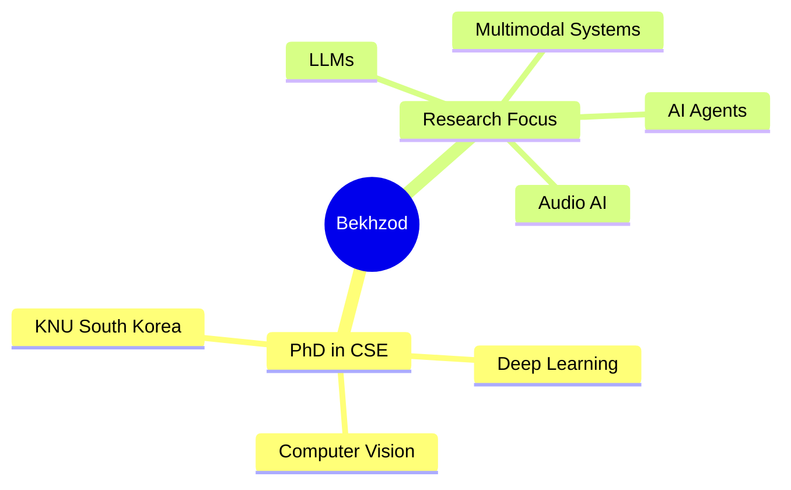

<!-- Animated Header with Wave -->
<div align="center">
  
# 🌟 Welcome to Bekhzod's AI Universe 🌟


<!-- Typing Animation -->
<a href="https://git.io/typing-svg"></a>

<!-- Profile Views Counter -->


<!-- Social Media Badges -->
<p align="center">
  <a href="https://www.linkedin.com/in/bekhzod-olimov-phd-33059bb1/"></a>
  <a href="https://scholar.google.com/citations?user=3QhMoi0AAAAJ&hl=en"></a>
  <a href="https://github.com/bekhzod-olimov"></a>
  <a href="https://github.com/TeachAI-UZ"></a>
</p>

</div>

---

<!-- Animated Gradient Divider -->


<!-- About Me Section with Stunning Design -->
<div align="center">

## 🎯 About Me


</div>

<table align="center">
<tr>
<td width="50%" valign="top">

### 👨‍🎓 Academic Excellence



</td>
<td width="50%" valign="top">

### 💼 Professional Journey

```diff
@@  Current Roles  @@
+ Director @ ChiwoocheonSoft
+ Senior AI Engineer & Researcher
+ Founder of TeachAI-UZ

! Transforming Ideas into Intelligent Solutions
# Open to Collaboration 🤝
```

</td>
</tr>
<tr>
<td colspan="2">

<div align="center">

### 🔬 Research Interests

<table>
  <tr>
    <td align="center" width="25%">
      <br>
      <b>Computer Vision</b><br>
      <sub>Image Processing & Analysis</sub>
    </td>
    <td align="center" width="25%">
      <br>
      <b>Large Language Models</b><br>
      <sub>NLP & Text Generation</sub>
    </td>
    <td align="center" width="25%">
      <br>
      <b>Audio Processing</b><br>
      <sub>Speech & Sound AI</sub>
    </td>
    <td align="center" width="25%">
      <br>
      <b>AI Agents</b><br>
      <sub>Autonomous Systems</sub>
    </td>
  </tr>
</table>

<br>

**🎓 PhD from [Kyungpook National University](https://en.knu.ac.kr/main/main.htm)** | **📍 Based in South Korea** | **🚀 Founder of [TeachAI-UZ](https://github.com/TeachAI-UZ)**

</div>

</td>
</tr>
</table>

<!-- Animated Gradient Divider -->


---

<!-- Tech Stack Section -->
<div align="center">

## 🛠️ Tech Arsenal

### 💻 Languages


### 🤖 AI/ML Frameworks


### ☁️ Cloud & Tools


### 🎨 Web & Visualization


</div>

---

<!-- Animated Gradient Divider -->


<!-- GitHub Stats Section -->
<div align="center">

## 📊 GitHub Analytics

<p align="center">
  
  
</p>

<p align="center">
  
  
</p>

<!-- GitHub Trophies -->
<p align="center">
  
</p>

<!-- Contribution Graph -->


<!-- Snake Animation -->
<picture>
  <source media="(prefers-color-scheme: dark)" srcset="https://raw.githubusercontent.com/bekhzod-olimov/bekhzod-olimov/main/output/github-contribution-grid-snake-dark.svg">
  <source media="(prefers-color-scheme: light)" srcset="https://raw.githubusercontent.com/bekhzod-olimov/bekhzod-olimov/main/output/github-contribution-grid-snake.svg">
  
</picture>

</div>

---

<!-- Animated Gradient Divider -->


<!-- Featured Research & Projects -->
<div align="center">

## 🚀 Featured Work

<table>
  <tr>
    <td align="center" width="33%">
      
      <h3>🔬 Research</h3>
      <p>Cutting-edge research in Computer Vision, LLMs, and Audio AI</p>
      <a href="https://scholar.google.com/citations?user=3QhMoi0AAAAJ&hl=en">
        
      </a>
    </td>
    <td align="center" width="33%">
      
      <h3>🎓 TeachAI-UZ</h3>
      <p>Empowering the next generation of AI engineers in Uzbekistan</p>
      <a href="https://github.com/TeachAI-UZ">
        
      </a>
    </td>
    <td align="center" width="33%">
      
      <h3>💼 Open Source</h3>
      <p>Contributing to impactful AI projects worldwide</p>
      <a href="https://github.com/bekhzod-olimov?tab=repositories">
        
      </a>
    </td>
  </tr>
</table>

</div>

---

<!-- Animated Gradient Divider -->


<!-- Current Focus Section -->
<div align="center">

## 🎯 Current Focus

<table>
  <tr>
    <td>🔭 Building advanced AI agents for real-world applications</td>
  </tr>
  <tr>
    <td>🌱 Exploring multimodal AI systems (Vision + Language + Audio)</td>
  </tr>
  <tr>
    <td>👯 Collaborating on transformative AI research projects</td>
  </tr>
  <tr>
    <td>💬 Mentoring aspiring AI engineers through TeachAI-UZ</td>
  </tr>
  <tr>
    <td>📫 Reach me: <a href="https://www.linkedin.com/in/bekhzod-olimov-phd-33059bb1/">LinkedIn</a> | <a href="https://scholar.google.com/citations?user=3QhMoi0AAAAJ&hl=en">Google Scholar</a></td>
  </tr>
</table>

</div>

---

<!-- Animated Gradient Divider -->


<!-- Connect Section -->
<div align="center">

## 💬 Let's Connect & Collaborate!

<p>
  <a href="https://www.linkedin.com/in/bekhzod-olimov-phd-33059bb1/">
    
  </a>
  <a href="https://scholar.google.com/citations?user=3QhMoi0AAAAJ&hl=en">
    
  </a>
  <a href="https://github.com/bekhzod-olimov">
    
  </a>
</p>

### 📧 Open for:
- 🤝 Research Collaborations
- 💼 Consulting Projects
- 🎤 Speaking Engagements
- 👨‍🏫 Mentorship Opportunities


</div>

---

<div align="center">
  
### ⭐ Star my repositories if you find them helpful!


**Made with ❤️ | © 2025 Bekhzod Olimov**

</div>

